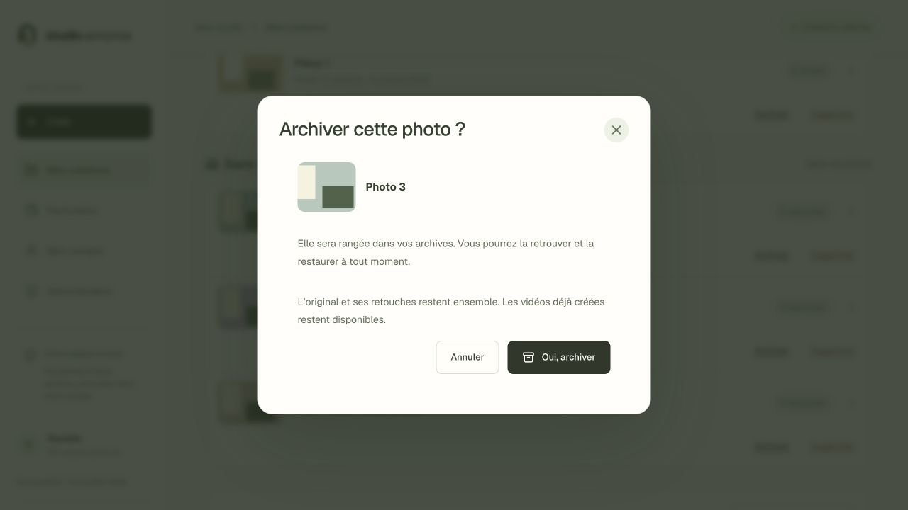
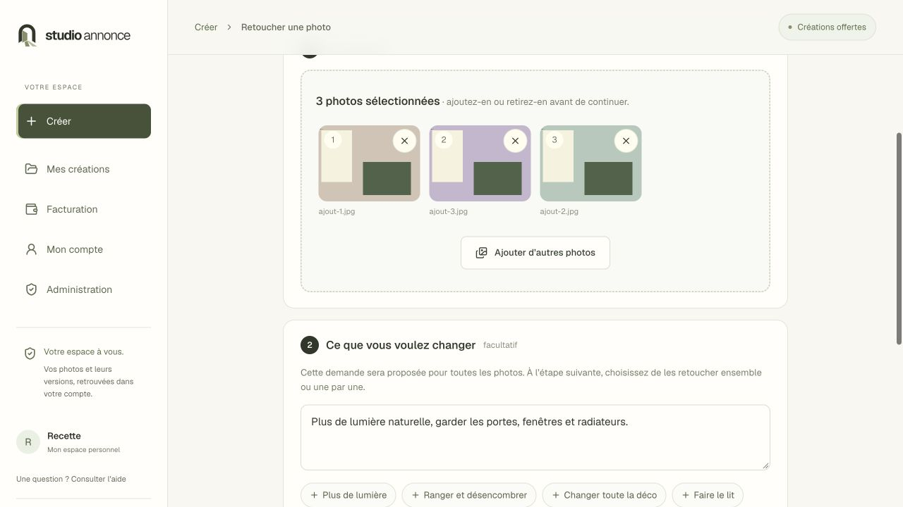

# Archives, corbeille et ajout multiple — 4 octobre 2026

Demande de Martin à 18:23 Bangkok : confirmer immédiatement l’archivage dans une petite popup, pouvoir supprimer photos et vidéos, et joindre plusieurs photos dès le premier écran de retouche.

## Comportement livré

- « Archiver » ouvre une boîte de dialogue centrée avec aperçu, explication, Annuler et Oui, archiver. La réussite est visible et les archives sont accessibles depuis Mes créations.
- « Supprimer » ouvre sa propre confirmation puis place la création dans la corbeille. « Restaurer » remet la photo ou la vidéo dans Mes créations. L’original et les versions photo restent associés ; aucune purge définitive n’est mise en place. La corbeille ne libère donc pas encore d’espace disque.
- Une génération en cours empêche la suppression de la photo ou de la vidéo concernée. Un autre compte ne peut ni lire ni supprimer ni restaurer ces créations.
- Le premier écran de retouche accepte plusieurs fichiers : jusqu’à 40 sur le web, 30 dans l’application mobile. Aperçus, retrait/désélection et ajout complémentaire avant envoi. Chaque fichier reste envoyé séparément, avec reprise sans duplication.
- Après l’ajout d’un lot, la sélection est reprise dans la préparation des retouches. La demande commune du formulaire web est conservée. L’utilisateur choisit le traitement ensemble (deux opérations simultanées maximum) ou une par une. L’ajout ne déclenche ni génération ni débit.
- Les vidéos existantes sont visibles dans Mes créations et ont aussi leur bouton Supprimer. La consultation de cette liste ne lance pas d’appel fournisseur.

## Vérifications

123 tests API réussis, dont six nouveaux scénarios sur la corbeille, les accès entre comptes, les générations en cours, la migration rejouable et la reprise d’un import déjà supprimé. 51 tests web et 23 tests mobile réussis. TypeScript, lint sans erreur, compilation Next et export Expo réussis.

Dans le navigateur de recette : annulation et confirmation d’archivage, suppression puis restauration d’une photo et d’une vidéo, ajout de trois photos depuis le premier écran, retrait puis réajout d’un fichier et conservation de la consigne. Les trois retouches se terminent avec le fournisseur simulé ; deux opérations au maximum sont actives simultanément. Sur téléphone à 390 px : confirmation, retour de réussite, restauration et ajout de deux photos puis d’une troisième sans perdre les premières. Le lot reste sélectionné à l’arrivée.

Les captures ci-dessous proviennent du compte fictif local, avec des images synthétiques, sans appeler les fournisseurs facturés :

## Publication

Livraison `creations-20261004T134311Z`, compte N0C `vzbbtadpbm`, branche `codex-travail`. Sauvegarde ciblée du code, des interfaces et de SQLite vérifiée sur N0C et copiée dans `/Users/more/Documents/Codex/studio-annonce-backups/creations-20261004T134311Z/`.

Migration additive `photos.supprime_le` et `videos.supprime_le`, avant redémarrage Passenger. 166 fichiers publiés vérifiés sur le disque distant ; 85 fichiers HTML/JS/CSS également relus via HTTPS avec empreintes identiques. L’API authentifiée retourne les trois vidéos du propriétaire, une corbeille vide et `Cache-Control: private, no-store`. Accès anonyme à la corbeille : 401.

Intégrité SQLite `ok`. Avant/après : 1 compte, 3 logements, 13 photos, 2 versions, 3 vidéos, aucun achat ni mouvement de crédit. Aucun original, aucune création client, aucune archive client supprimée. `.env`, `.htaccess` et accueil public inchangés. Seuls le studio connecté, les ressources nécessaires, l’API ciblée et l’export mobile ont été publiés.

Les limites déjà consignées dans [le rapport général](CORRECTIONS-STUDIO-2026-10-04.md) restent distinctes de cette livraison : paiements reportés, extraction automatique des photos d’annonces non livrée et qualification réelle du parcours vidéo multiphoto à poursuivre. Les tests visuels décrits ici utilisent un fournisseur simulé, pas une nouvelle génération payante.
