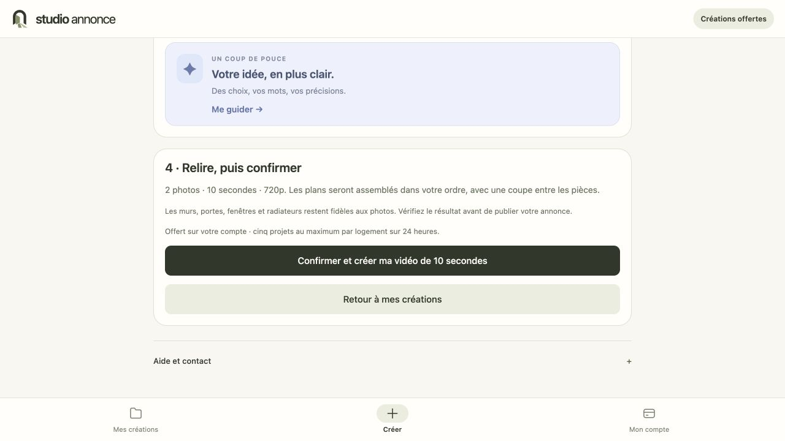

# Studio Annonce — corrections du 4 octobre 2026

## Problème observé et cause confirmée

Martin ajoutait plusieurs photos pour préparer une vidéo. Une seule arrivait, puis l'écran affichait « Une erreur est survenue ». Le compte N0C refusait aussi une écriture indépendante avec `Disk quota exceeded` : le volume autorisé était plein. Les archives de déploiement occupaient une partie de cette place.

Trois archives de l'ancien site ont été transférées dans `/Users/more/Documents/Codex/studio-annonce-backups/archives-hebergement-20261004/`. Leurs tailles, SHA-256 et catalogues tar ont été contrôlés avant retrait des seules copies distantes :

| Dossier historique | Octets transférés | SHA-256 |
| --- | ---: | --- |
| `publication-compte-20261001T042530Z` | 72 313 068 | `f636362a8108d4f66334c1d8e725617c9ebcf289f037b950b6d6084fb32d2942` |
| `comparateurs-20260930T163004Z` | 71 735 270 | `4790870ae427b4b9016c3f502891cacf909bfbf4a7c8f8b23ea42b49bf1c7ed6` |
| `exemples-blog-20260930T1605Z` | 67 196 172 | `377cc596a6e2c4dcebe695394cc4472fef9aec93c8b9b3eb748b59b96bc88815` |

211 244 510 octets ont ainsi été libérés. Les photos personnelles, originaux, versions et la base ont été conservés. Les sauvegardes nouvelles doivent rester ciblées et leur croissance surveillée ; ce déplacement ne remplace pas un stockage durable dimensionné pour le service.

## Corrections livrées

| Demande de Martin | Résultat |
| --- | --- |
| Plusieurs photos ajoutées sans erreur opaque | Import JSON borné, validation serveur, erreurs françaises, réduction des grandes images sur l'appareil. Les fichiers de l'appareil restent intacts. |
| Conserver ce qui est arrivé si un fichier échoue | Envois séparés, poursuite du lot, reprise des fichiers restants ; même confirmation = même photo, y compris après une réponse perdue. |
| Navigation sans attente de génération | Bibliothèque résumée en une requête, formulaires conservés lors des changements d'outil ; le suivi vidéo et les appels fournisseur sont séparés. |
| Retoucher d'autres photos avant la vidéo | Deux actions depuis l'éditeur : continuer les retouches ou préparer une vidéo. La préparation ne lance aucun appel de génération. |
| Plusieurs retouches en parallèle | Sélection d'un lot et demande commune, deux traitements simultanés au maximum, état par photo et résultat accessible dans chaque éditeur. Une opération inconnue est vérifiée avant une nouvelle tentative. |
| Afficher les photos seulement sur demande | Bibliothèque vidéo repliée derrière « Choisir parmi mes photos », recherche et ordre explicite. |
| Plusieurs photos et une vraie demande vidéo | Une à six photos d'un logement, choix original/version, monter/descendre/retirer, demande libre ou brief guidé, récapitulatif et confirmation. |
| Vidéo jusqu'à 30 secondes | Un plan de cinq secondes par photo, 5 à 30 secondes au total, assemblage 720p avec coupes, sans son. La fidélité doit être contrôlée sur le résultat. |
| Chargement lisible | État de génération et nombre de plans prêts. Le projet accepté reste en base ; une réponse perdue ne doit pas recréer les clips déjà facturés. |
| Trier ou retirer des créations | Recherche, tri et archivage réversible ; originaux et versions conservés, restauration depuis les archives. |
| Même parcours mobile | Bibliothèque, lot de retouches, import repris et préparation vidéo connectés à la même API. Export web Expo publié ; aucune distribution native signée nouvelle. |

## Vérifications

- 117 tests API : imports répétés, erreur de stockage avec rollback, préservation de l'offre, accès entre comptes, migrations répétées, archivage, réservations photo, confirmation vidéo, reçus fournisseur, bail SQL, suspension, montage et reprise sans régénérer les plans terminés.
- 42 tests de logique web, 23 tests mobile ; exports Next/Expo, TypeScript et lint réussis. Les quatre avertissements web concernent des images privées déjà servies directement.
- Dans le navigateur de recette, un lot de trois fichiers avec panne simulée sur le deuxième a conservé les deux réussites, puis ajouté uniquement le fichier restant. Aucun appel vidéo avant la confirmation.
- Deux retouches ont été exécutées simultanément avec le fournisseur de recette, et leurs résultats enregistrés. Sélection et confirmation mobile vérifiées à 390 px, archivage et restauration rejoués.
- La recette web a produit un MP4 de 15 secondes avec un fournisseur simulé. L'assemblage véritable de deux clips artificiels a aussi été exécuté sur N0C : 10 secondes, 1280×720, décodage complet.
- Trois fichiers JPEG synthétiques de 1 420 987, 1 588 341 et 1 720 385 octets ont été envoyés vers l'API HTTPS de production, avec réponses 200 en 3,43 s, 1,38 s et 1,34 s. Répéter chaque confirmation a retrouvé le même identifiant. Une seule offre a été attribuée au compte de recette, sans débit ni appel IA.
- Les données synthétiques de production ont été retirées après le contrôle, sans modifier les données du propriétaire : 1 compte, 3 logements, 7 photos, 2 versions, 2 vidéos, intégrité SQLite `ok`.
- Les six fichiers API et les 36 fichiers HTML/JS ciblés correspondent à leurs empreintes locales. Ces 36 fichiers ont aussi été récupérés via HTTPS depuis le serveur, sans écart. La connexion publique fonctionne dans le navigateur intégré. Les requêtes de contrôle Python depuis le Mac ont reçu un 403 ; elles ne sont pas utilisées comme preuve de fonctionnement navigateur.

Cette capture montre le parcours vérifié localement avec un compte fictif. Elle ne représente pas une génération Higgsfield réelle du propriétaire.

## Publication et reprise

Branche `codex-travail`. Sauvegarde ciblée et SQLite avant publication : `import-video-20261004T102137Z`, sur N0C et dans `/Users/more/Documents/Codex/studio-annonce-backups/`. Migration additive avant redémarrage Passenger. Seuls l'API ciblée, `/app/`, les ressources Next et `/mobile/` sont publiés ; `.env`, `.htaccess`, originaux et autres sites sont conservés.

Les étapes vidéo avancent lors des lectures de suivi, avec au maximum deux traitements en arrière-plan et un bail SQL qui empêche deux processus de traiter la même étape. Si le navigateur ferme, une étape déjà lancée peut se terminer ; les suivantes attendent une nouvelle lecture. Ne pas présenter cette version comme un worker autonome durable. Le brouillon de préparation reste dans le stockage local du navigateur ; seul un projet confirmé et ses sources sont enregistrés au serveur.

## Suites conservées, pas présentées comme terminées

- Vérifier visuellement une vraie vidéo Higgsfield multiphoto du propriétaire, les raccords et les repères structurels ; aucune nouvelle génération payante n'a été utilisée pour cette recette.
- Lien Airbnb/Booking : le lien est enregistré et le client ajoute ses propres photos ; aucune extraction automatique n'est livrée.
- Paiements et tarification par essai vidéo : différés à la fin, selon la dernière demande de Martin. Le compte propriétaire reste gratuit ; les générations client et les ventes restent fermées.
- Stockage durable hors quota d'hébergement, suivi de l'espace et traitement autonome des tâches longues avant ouverture commerciale.
- Améliorer la délivrabilité des codes email et finaliser la qualification réelle du parcours client avant d'annoncer une ouverture à tous.
